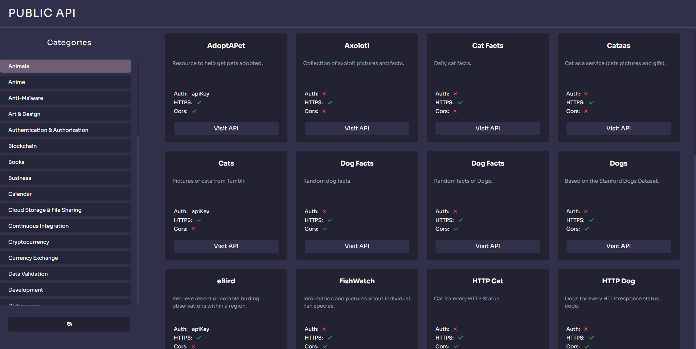
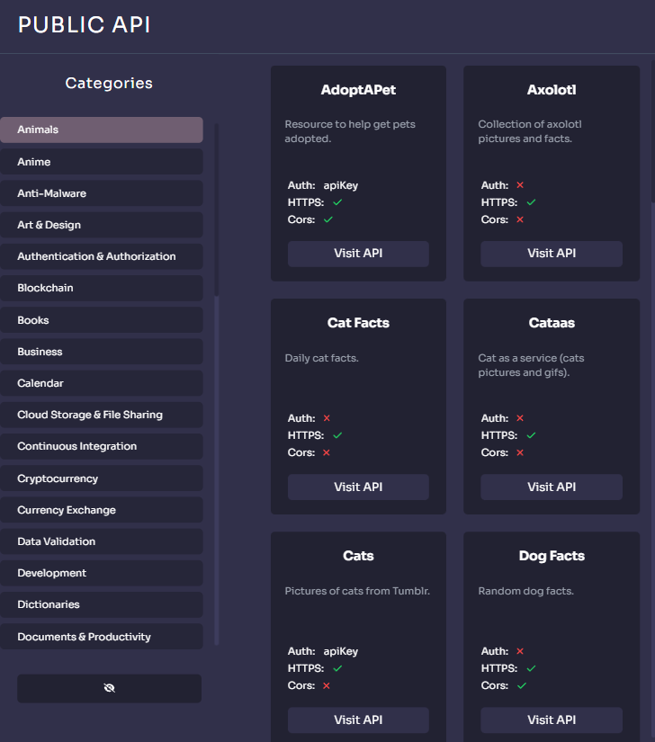
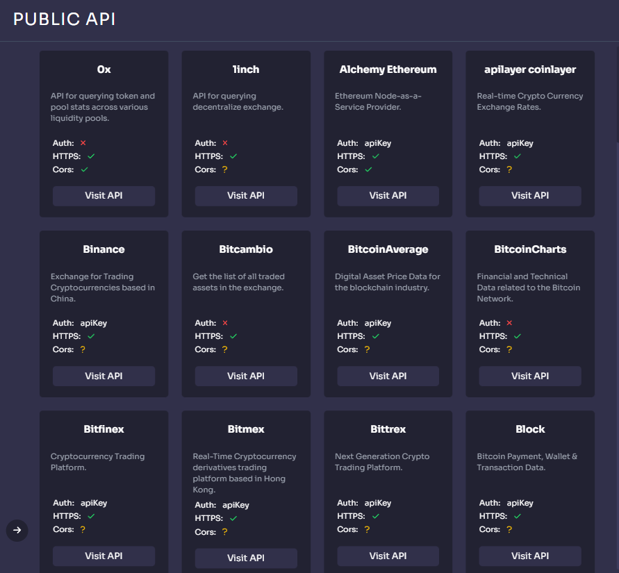

# public-apis
[Publicapis Repository](https://github.com/public-apis/public-apis)
This repository listing public apis with using the above repository

## Demo
[Netlify Demo](https://publicapi.netlify.app/)

## Screenshots




## Project Setup
This template should help get you started developing with Vue 3 in Vite.

```sh
npm install
```

### Compile and Hot-Reload for Development

```sh
npm run dev
```

### Compile and Minify for Production

```sh
npm run build
```
